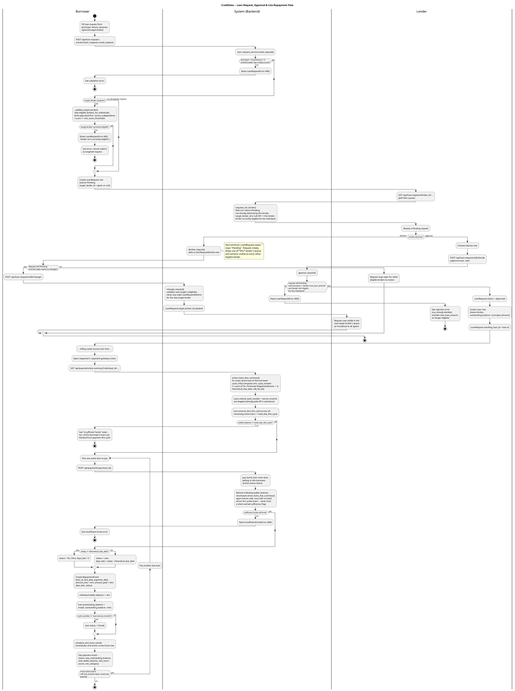

# CreditSetu — Activity Diagram: Loan Request → Approval → Repayment

This diagram traces the real, end-to-end control flow across three actors —
**Borrower**, **Lender**, and the **System (backend)** — for CreditSetu's
dual-path credit flow: requesting a loan, a lender deciding on it, and the
live repayment/payment-gateway cycle. It was built by reading the actual
implementation, not a generic textbook "loan process":

- `app/services/loan_request_service.py` — `create_request`, `_validate_target_lender` /
  `eligible_lenders_for_individual`, `retarget_request`, `decline_request`,
  `approve_request`, `requests_for_lender`
- `app/routers/loan_requests.py` — `POST /api/loan-requests`,
  `POST /api/loan-requests/{id}/retarget`, `POST /api/loan-requests/{id}/decide`,
  `GET /api/loan-requests` (lender queue)
- `app/routers/payments.py` — `GET /api/payments/due-summary`,
  `POST /api/payments/pay`
- `app/services/payment_service.py` — `compute_emi`, `cycle_info`,
  `active_loans_due_summary`, `pay_loan`

## PlantUML source

## Walkthrough

1. **Request creation (Borrower → System).** The borrower submits
   principal/tenure/purpose and an optional `target_lender_id` via
   `POST /api/loan-requests`, handled by `loan_requests.create_request` which
   calls `loan_request_service.create_request`. The service rejects
   non-positive principal/tenure and borrowers with no `latest_score`. If a
   target lender is given, `_validate_target_lender` reuses
   `eligible_lenders_for_individual` (SHG-approval-link / `serves_independents`
   / score-threshold checks) to make sure the pick is legitimate before the
   `LoanRequest` (status `Pending`) is created.

2. **Lender queue (Lender → System).** `GET /api/loan-requests?lender_id=...`
   runs `requests_for_lender`, which shows a lender only Pending requests they
   haven't already declined, that are either broadcast (`target_lender_id is
   null`) or targeted at them, and for which they are currently eligible.

3. **Decline is non-terminal.** `decline_request` just inserts a
   `LoanRequestDecline` row for that lender/request pair — `LoanRequest.status`
   stays `Pending`, so the request remains visible to every other eligible
   lender. If the request was targeted, the borrower can call
   `POST /api/loan-requests/{id}/retarget`; `retarget_request` validates the
   new target's eligibility and deletes any stale decline row for that new
   target so a prior decline on a different target doesn't block re-targeting
   (per `docs/API_CONTRACT_PAYMENTS.md §3.1/§3.4`).

4. **Approval creates the real Loan.** `approve_request` re-checks the request
   is still `Pending`, that `requested_principal <= lender.max_loan_amount`,
   and that the lender is still eligible for the individual, then flips
   `LoanRequest.status` to `Approved`, creates a `Loan` (`status=Active`,
   `outstanding_balance = principal_amount`), and links
   `resulting_loan_id`.

5. **Repayment entry point.** After cycles accrue, the borrower opens the
   payment screen, which calls `GET /api/payments/due-summary`. For every
   `Active` loan, `payment_service.cycle_info` derives `emi` (simple-interest
   amortized), `cycle_number` (count of prior `On_Time`/`Late`
   `RepaymentEvent`s + 1), `theoretical_due_date`, and `will_be_late`, purely
   from stored columns (calendar-independent). Loans whose `cycle_number`
   already exceeds `tenure_months` are dropped from the payable list.
   `total_due_this_cycle` sums `amount_due_this_cycle` across all remaining
   active loans.

6. **Aggregate sufficiency gate.** If `wallet_balance < total_due_this_cycle`,
   the UI shows an insufficient-funds state and blocks payment on **all** of
   the borrower's loans, not just one. Otherwise the borrower can proceed to
   pay.

7. **Per-loan payment (`POST /api/payments/pay`).** `pay_loan` re-validates
   ownership/`Active` status, then — critically — refreshes the wallet balance
   and recomputes `active_loans_due_summary` again immediately before
   deducting, with no intervening query, to close a race window (§4.1 fix).
   If funds have since become insufficient, it raises
   `InsufficientFundsError` (400) even though the initial due-summary looked
   fine. Otherwise it compares `today` to `theoretical_due_date` to decide
   `On_Time` vs `Late` (recording `days_late`), writes a `RepaymentEvent`,
   decrements `wallet_balance` and `loan.outstanding_balance` by the EMI,
   closes the loan if `cycle_number >= tenure_months`, and calls
   `compute_and_store_score` to recompute and persist a new score, which is
   returned to the borrower alongside the updated balances. The borrower can
   repeat this for each remaining due loan in the same session.

## Files/functions verified against

- `app/services/loan_request_service.py` (full file)
- `app/routers/loan_requests.py` (full file)
- `app/routers/payments.py` (full file)
- `app/services/payment_service.py` (full file, the correct payments-logic
  module — there is no separate `payment_service.py` vs. another file; this
  is the one imported by `app/routers/payments.py`)
