# CreditSetu — UML Class Diagram

Source: `app/models.py` (SQLAlchemy ORM models), read in full on 2026-09-17.
Covers the dual-path (SHG-linked + independent) credit-scoring schema plus
the role-based session redesign and the payments-feature additions
(`Individual.wallet_balance`, `LoanRequest.target_lender_id`).

```plantuml
@startuml CreditSetu_ClassDiagram
skinparam classAttributeIconSize 0
skinparam linetype ortho
hide circle

' ===================== Reference / geography =====================
class District {
  +id: int <<PK>>
  +name: string <<unique>>
  +state: string
  +lat: float
  +lon: float
}

' ===================== Group entity =====================
class SHG {
  +id: int <<PK>>
  +name: string
  +village: string
  +district_id: int <<FK>>
  +formed_date: date
  +status: enum{Active,Inactive,Dissolved}
  +username: string <<unique, nullable>>
  -password_hash: string <<nullable>>
  --
  +aggregate_repayment_rate(): float
  +aggregate_attendance_rate(): float
}
note right of SHG
  Computed properties only —
  not stored columns. Derived by
  walking members -> loans ->
  repayment_events (and
  attendance_records).
  total_members omitted (denormalized counter).
end note

' ===================== Core borrower entity =====================
class Individual {
  +id: int <<PK>>
  +name: string
  +phone: string <<unique>>
  +district_id: int <<FK>>
  +monthly_income: float
  +shg_id: int <<FK, NULLABLE>>
  +status: enum{Active,Inactive,Blocked}
  -password_hash: string <<nullable>>
  +wallet_balance: float <<nullable, treat NULL as 0.0>>
  --
  +is_shg_linked(): bool
  +latest_score(): CreditScore
}
note right of Individual
  **shg_id is the dual-path pivot**:
  NULL = independent borrower (no
  SHG trust boost); set = SHG member.
  Every scoring/eligibility branch
  keys off this one nullable FK.
  village/occupation/has_bank_account/
  joined_date omitted for readability.
end note

' ===================== Session tables (role-based auth) =====================
class IndividualSession {
  +id: int <<PK>>
  +individual_id: int <<FK>>
  +token: string <<unique>>
  +created_at: datetime
  +expires_at: datetime
}
class LenderSession {
  +id: int <<PK>>
  +lender_id: int <<FK>>
  +token: string <<unique>>
  +created_at: datetime
  +expires_at: datetime
}
class SHGSession {
  +id: int <<PK>>
  +shg_id: int <<FK>>
  +token: string <<unique>>
  +created_at: datetime
  +expires_at: datetime
}
class AdminSession {
  +id: int <<PK>>
  +token: string <<unique>>
  +created_at: datetime
  +expires_at: datetime
}
note bottom of AdminSession
  No FK — admin is an env-var
  credential, not a business entity.
end note

' ===================== SHG-only behavioural data =====================
class SHGAttendanceRecord {
  +id: int <<PK>>
  +shg_id: int <<FK>>
  +individual_id: int <<FK>>
  +meeting_date: date
  +present: bool
}

class SavingsRecord {
  +id: int <<PK>>
  +individual_id: int <<FK>>
  +period: date
  +amount_expected: float
  +amount_saved: float
}

' ===================== Lender side =====================
class Lender {
  +id: int <<PK>>
  +name: string
  +type: enum{Bank,NBFC,MFI,Fintech}
  +min_score_threshold: int
  +max_loan_amount: float
  +base_interest_rate: float
  +serves_independents: bool
  +username: string <<unique, nullable>>
  -password_hash: string <<nullable>>
}

class SHGLenderLink {
  +id: int <<PK>>
  +shg_id: int <<FK>>
  +lender_id: int <<FK>>
  +status: enum{Pending,Approved,Rejected}
  +requested_date: date
  +decided_date: date <<nullable>>
  +initiated_by_role: enum{shg,lender}
  .. unique(shg_id, lender_id) ..
}
note right of SHGLenderLink
  Approve/reject join table between
  SHG and Lender: an SHG opts which
  lenders may see/offer to its members.
  Independents are open to all lenders
  (serves_independents flag) and never
  appear here. notes column omitted.
end note

' ===================== Loans & repayment =====================
class Loan {
  +id: int <<PK>>
  +individual_id: int <<FK>>
  +lender_id: int <<FK, nullable>>
  +principal_amount: float
  +interest_rate: float
  +tenure_months: int
  +disbursement_date: date
  +outstanding_balance: float
  +status: enum{Active,Closed,Defaulted,Written_Off}
}
note right of Loan
  lender_id nullable: NULL marks
  synthetic pre-marketplace history
  seeded before the lender flow existed.
  purpose omitted for readability.
end note

class RepaymentEvent {
  +id: int <<PK>>
  +loan_id: int <<FK>>
  +due_date: date
  +payment_date: date <<nullable>>
  +amount_due: float
  +amount_paid: float
  +days_late: int
  +status: enum{On_Time,Late,Partial,Missed}
}

' ===================== Credit scoring =====================
class CreditScore {
  +id: int <<PK>>
  +individual_id: int <<FK>>
  +score: int
  +risk_category: enum{Very Low,Low,Medium,High,Very High}
  +base_component: enum{shg_bootstrap,independent_bootstrap,model}
  +model_version: string
  +calculated_date: datetime
  +notes: string
}
note right of CreditScore
  **Append-only history**, not a
  mutable column on Individual —
  each scoring run inserts a new row.
  Individual.latest_score() just
  reads the last one by calculated_date.
end note

class ScoreExplanation {
  +id: int <<PK>>
  +score_id: int <<FK>>
  +feature_name: string
  +feature_value: string
  +shap_contribution: float
}
note right of ScoreExplanation
  One row per SHAP feature contribution
  per CreditScore, so "why this score"
  renders without re-running the model.
end note

' ===================== Marketplace: offers & requests =====================
class LoanOffer {
  +id: int <<PK>>
  +lender_id: int <<FK>>
  +individual_id: int <<FK>>
  +principal_offer: float
  +rate_offer: float
  +tenure_offer: int
  +status: enum{Proposed,Accepted,Rejected,Withdrawn}
  +created_date: datetime
  +decided_date: datetime <<nullable>>
}
note right of LoanOffer
  Lender-initiated: lender proposes,
  borrower accepts/rejects.
end note

class LoanRequest {
  +id: int <<PK>>
  +individual_id: int <<FK>>
  +requested_principal: float
  +requested_tenure: int
  +purpose: string
  +status: enum{Pending,Approved,Withdrawn}
  +created_date: datetime
  +decided_date: datetime <<nullable>>
  +decided_by_lender_id: int <<FK, nullable>>
  +resulting_loan_id: int <<FK, nullable>>
  +target_lender_id: int <<FK, nullable>>
}
note right of LoanRequest
  Borrower-initiated mirror of LoanOffer.
  target_lender_id: NULL = broadcast to
  every eligible lender (default,
  historical behavior); set = visible
  only to that one lender (payments
  feature, API_CONTRACT_PAYMENTS.md §1.2).
end note

class LoanRequestDecline {
  +id: int <<PK>>
  +request_id: int <<FK>>
  +lender_id: int <<FK>>
  +declined_date: datetime
  .. unique(request_id, lender_id) ..
}
note right of LoanRequestDecline
  One lender passing on a broadcast
  request does NOT close it for others —
  request stays Pending/visible to
  every other eligible lender.
end note

' ===================== ML stretch feature =====================
class AnomalyFlag {
  +id: int <<PK>>
  +individual_id: int <<FK>>
  +anomaly_score: float
  +reason: text
  +flagged_date: datetime
}

' ===================== Relationships =====================
District "1" -- "many" SHG : located in
District "1" -- "many" Individual : located in

SHG "1" -- "many" Individual : members
SHG "1" -- "many" SHGAttendanceRecord
SHG "1" -- "many" SHGLenderLink
SHG "1" -- "many" SHGSession
SHG "many" -- "many" Lender : via SHGLenderLink

Individual "1" -- "many" IndividualSession
Individual "1" -- "many" SavingsRecord
Individual "1" -- "many" SHGAttendanceRecord
Individual "1" -- "many" Loan
Individual "1" -- "many" CreditScore : score history\n(append-only)
Individual "1" -- "many" LoanOffer
Individual "1" -- "many" LoanRequest
Individual "1" -- "many" AnomalyFlag

Lender "1" -- "many" LenderSession
Lender "1" -- "many" LoanOffer
Lender "1" -- "many" SHGLenderLink
Lender "1" -- "0..many" Loan : originates (nullable FK)
Lender "1" -- "many" LoanRequestDecline
Lender "0..1" -- "many" LoanRequest : decided_by
Lender "0..1" -- "many" LoanRequest : target_lender

Loan "1" -- "many" RepaymentEvent
Loan "0..1" -- "1" LoanRequest : resulting_loan

CreditScore "1" -- "many" ScoreExplanation

LoanRequest "1" -- "many" LoanRequestDecline

@enduml
```

## Key design decisions the diagram reveals

**The nullable `shg_id` dual-path pivot.** `Individual.shg_id` is the single
nullable foreign key that lets one `Individual` table serve both SHG-linked
and fully independent borrowers, instead of maintaining two parallel schemas.
`NULL` means no SHG trust boost and no attendance/group-savings data; every
scoring and lender-eligibility rule in the app branches on this one column
(surfaced as the `is_shg_linked` computed property).

**Append-only `CreditScore` history.** Credit scores are never updated in
place — each scoring run inserts a new `CreditScore` row (with its own
`base_component`, `model_version`, and timestamp), and `Individual.latest_score`
is just "the last row by `calculated_date`." This gives the dashboards a real
score-over-time series instead of a single mutable value, and each score's
`ScoreExplanation` rows (per-feature SHAP contributions) are permanently tied
to that specific historical run, not recomputed later.

**`SHGLenderLink` as a stateful many-to-many join.** Rather than a plain
association table, `SHGLenderLink` carries its own status workflow
(`Pending → Approved/Rejected`) and an `initiated_by_role` flag so the API
knows whose turn it is to act. It gates visibility for SHG-linked borrowers
only — independents bypass it entirely via `Lender.serves_independents`.

**Omitted for readability**: `SHG.total_members` (denormalized counter),
`Individual.village/occupation/has_bank_account/joined_date`, `Loan.purpose`,
`SHGLenderLink.notes`, and most `password_hash` fields are marked but not
elaborated. The four session classes (`IndividualSession`, `LenderSession`,
`SHGSession`, `AdminSession`) are structurally identical opaque-bearer-token
tables, shown in full since they matter for the role-based auth story, but
their symmetry is called out rather than each being separately explained.
