# CreditSetu — UML Use Case Diagram

This diagram and the scenarios below are grounded directly in the FastAPI routers
(`app/routers/*.py`), the SQLAlchemy models (`app/models.py`), and the four
role-specific dashboards (`frontend/src/pages/dashboards/*.jsx`,
`frontend/src/pages/login/LoginPage.jsx`). Every use case corresponds to a real
endpoint or a real UI feature that calls one.

CreditSetu has four separate, role-gated logins (`POST /api/auth/login`,
`/api/auth/lender/login`, `/api/auth/shg/login`, `/api/auth/admin/login`), each
backed by its own session table (`IndividualSession`, `LenderSession`,
`SHGSession`, `AdminSession`) except Admin, which is a single env-var credential
(`ADMIN_USERNAME`/`ADMIN_PASSWORD`) with no business row. Every non-public
endpoint requires one of the four `get_current_*` dependencies in
`app/routers/auth.py`, enforced server-side (not just hidden in the UI) — most
scenarios below include the 401/403 checks the server actually performs.

**Known inconsistency, not modeled as a use case:** `BorrowerDashboard.jsx` renders
a "Recompute my score" button that calls `POST /api/individuals/{id}/recompute-score`,
but that endpoint's dependency is `get_current_admin` only (`app/routers/individuals.py`).
A real borrower session is not a valid admin token, so this button would fail
with 401 in practice. The diagram therefore places "Recompute Any Borrower's Score"
under Admin only, matching the actual server-side authorization.

The public, unauthenticated `GET /api/dashboard/home-highlights` endpoint (marketing
home-page feed) is likewise omitted — it isn't gated to any of the four actors.

## PlantUML Source

```plantuml
@startuml CreditSetu_UseCaseDiagram
left to right direction
skinparam packageStyle rectangle
skinparam usecase {
  BackgroundColor #F5F8FF
  BorderColor #3B5B92
}

actor Borrower
actor Lender
actor "Self-Help Group (SHG)" as SHG
actor Admin

rectangle "CreditSetu" {

  ' ---- Shared / Auth ----
  usecase "Log In" as UC_Login
  usecase "Log Out" as UC_Logout
  usecase "Browse Lender Directory" as UC_LenderDirectory

  ' ---- Borrower ----
  usecase "View Own Profile & Credit Score" as UC_ViewProfile
  usecase "View Score History" as UC_ScoreHistory
  usecase "View SHAP Score Explanation" as UC_ShapExplain
  usecase "View Improvement Tips" as UC_Tips
  usecase "View Suggested Lenders" as UC_SuggestedLenders
  usecase "View Own SHG Info" as UC_OwnShgInfo
  usecase "Request Loan (Broadcast or Targeted)" as UC_RequestLoan
  usecase "View Eligible Lenders for Request" as UC_EligibleLenders
  usecase "Retarget Declined Loan Request" as UC_Retarget
  usecase "Withdraw Loan Request" as UC_Withdraw
  usecase "View Loan Offers" as UC_ViewOffers
  usecase "Decide on Loan Offer (Accept/Reject)" as UC_DecideOffer
  usecase "View Due Summary" as UC_DueSummary
  usecase "Repay Loan via Payment Gateway" as UC_RepayLoan
  usecase "Recompute Credit Score" as UC_Recompute

  ' ---- Lender ----
  usecase "View Own Reputation Score" as UC_Reputation
  usecase "Browse SHGs by District" as UC_BrowseShgs
  usecase "View Linked SHG Members" as UC_LinkedMembers
  usecase "Request SHG Partnership" as UC_LenderRequestLink
  usecase "Decide SHG-Initiated\nPartnership Request" as UC_LenderDecideLink
  usecase "View Eligible Borrowers" as UC_EligibleBorrowers
  usecase "Make Loan Offer" as UC_MakeOffer
  usecase "View Own Offers" as UC_LenderOwnOffers
  usecase "View Incoming Loan Requests" as UC_IncomingRequests
  usecase "Approve / Decline Loan Request" as UC_DecideRequest

  ' ---- SHG ----
  usecase "View Own Group Stats & Members" as UC_ShgStats
  usecase "View Linked Lenders" as UC_ShgLinkedLenders
  usecase "Request Lender Partnership" as UC_ShgRequestLink
  usecase "Decide Lender-Initiated\nPartnership Request" as UC_ShgDecideLink

  ' ---- Admin ----
  usecase "View Platform Dashboard Summary" as UC_DashboardSummary
  usecase "Browse / Search All Borrowers" as UC_BrowseIndividuals
  usecase "View Any Individual's Detail" as UC_AdminViewIndividual
  usecase "View District Trust Heatmap" as UC_GeoHeatmap
  usecase "View Anomaly Flags" as UC_ViewAnomalies
  usecase "Re-run Anomaly Detection" as UC_RunAnomalies
  usecase "View Model / Scoring Health" as UC_ModelHealth
  usecase "View Platform-wide SHG-Lender Links" as UC_AdminLinks
  usecase "Recompute Any Borrower's Score" as UC_AdminRecompute
}

' ===================== Borrower =====================
Borrower --> UC_Login
Borrower --> UC_Logout
Borrower --> UC_ViewProfile
Borrower --> UC_ScoreHistory
Borrower --> UC_SuggestedLenders
Borrower --> UC_LenderDirectory
Borrower --> UC_OwnShgInfo
Borrower --> UC_RequestLoan
Borrower --> UC_EligibleLenders
Borrower --> UC_Retarget
Borrower --> UC_Withdraw
Borrower --> UC_ViewOffers
Borrower --> UC_DecideOffer
Borrower --> UC_DueSummary
Borrower --> UC_RepayLoan

' ===================== Lender =====================
Lender --> UC_Login
Lender --> UC_Logout
Lender --> UC_Reputation
Lender --> UC_BrowseShgs
Lender --> UC_LinkedMembers
Lender --> UC_LenderRequestLink
Lender --> UC_LenderDecideLink
Lender --> UC_EligibleBorrowers
Lender --> UC_MakeOffer
Lender --> UC_LenderOwnOffers
Lender --> UC_IncomingRequests
Lender --> UC_DecideRequest
Lender --> UC_LenderDirectory

' ===================== SHG =====================
SHG --> UC_Login
SHG --> UC_Logout
SHG --> UC_ShgStats
SHG --> UC_ShgLinkedLenders
SHG --> UC_ShgRequestLink
SHG --> UC_ShgDecideLink
SHG --> UC_LenderDirectory

' ===================== Admin =====================
Admin --> UC_Login
Admin --> UC_Logout
Admin --> UC_DashboardSummary
Admin --> UC_BrowseIndividuals
Admin --> UC_AdminViewIndividual
Admin --> UC_GeoHeatmap
Admin --> UC_ViewAnomalies
Admin --> UC_RunAnomalies
Admin --> UC_ModelHealth
Admin --> UC_AdminLinks
Admin --> UC_AdminRecompute

' ===================== <<include>> / <<extend>> =====================
UC_ViewProfile ..> UC_ShapExplain : <<include>>
UC_ViewProfile ..> UC_Tips : <<include>>
UC_AdminViewIndividual ..> UC_ShapExplain : <<include>>

UC_RepayLoan ..> UC_DueSummary : <<include>>
UC_RepayLoan ..> UC_Recompute : <<include>>

UC_Retarget ..> UC_RequestLoan : <<extend>>

UC_MakeOffer ..> UC_EligibleBorrowers : <<extend>>
UC_LenderDecideLink ..> UC_LinkedMembers : <<extend>>
UC_ShgDecideLink ..> UC_ShgLinkedLenders : <<extend>>

@enduml
```

## Written Use-Case Scenarios

### 1. Borrower Requests and Repays a Loan

**Actor(s):** Borrower

**Preconditions:**
- Borrower is logged in (`POST /api/auth/login` returned a valid bearer token, stored as `IndividualSession`).
- Borrower has at least one eligible lender, per `loan_request_service.eligible_lenders_for_individual` — either an `Approved` `SHGLenderLink` for their SHG, or a lender with `serves_independents = true` if they are independent.

**Main Flow:**
1. Borrower opens "Need a loan?" on the Borrower Dashboard and enters principal, tenure, and optional purpose.
2. Borrower chooses **Broadcast to all eligible lenders** (default) or **Choose a specific lender** from the eligible-lender picker (`GET /api/loan-requests/eligible-lenders`).
3. Frontend calls `POST /api/loan-requests` with `individual_id` forced from the session (not trusted from the body); `target_lender_id` is set only in specific mode. A `LoanRequest` row is created with `status = "Pending"`.
4. A lender (broadcast or targeted) approves the request via `POST /api/loan-requests/{id}/decide`, which calls `loan_request_service.approve_request` — this creates a `Loan` and sets `resulting_loan_id`.
5. Borrower opens **Repay** (`/borrower/repay`), signs into the demo payment gateway (`RepayPage.jsx`, hardcoded `abc`/`123` — a UI-only gate, not a backend credential), and the page fetches `GET /api/payments/due-summary?individual_id=...`.
6. Due-summary returns `wallet_balance`, `total_due_this_cycle` (summed across *all* the borrower's active loans), and `sufficient_funds`.
7. Borrower clicks **Pay this loan** for one loan; frontend calls `POST /api/payments/pay` with `loan_id`.
8. `payment_service.pay_loan` re-checks aggregate sufficiency server-side, deducts the wallet, records a `RepaymentEvent`, updates `outstanding_balance`, and — inside the same call — invokes `compute_and_store_score` to recompute and append a new `CreditScore` row, which the UI shows immediately as "New score: …".

**Alternate / Exception Flows:**
- **3a. No eligible lenders currently:** The picker shows "No lenders currently meet the eligibility criteria…"; the borrower may still broadcast, and the request waits as `Pending` until a lender becomes eligible.
- **4a. Sole targeted lender declines:** The request stays `Pending` (a decline does not close it), but the borrower can call **Retarget Declined Loan Request** (`POST /api/loan-requests/{request_id}/retarget`) to switch to another lender or back to broadcast (`extend` of Request Loan).
- **7a. Insufficient funds:** If the server-side aggregate check fails, `pay_loan` raises `InsufficientFundsError`; the API returns HTTP 400 with `{"error": "insufficient_funds", "wallet_balance", "total_due_this_cycle"}`, and the whole Repay page drops into a blocked state (`blockedInfo`) regardless of which loan button was clicked, showing the shortfall and disabling further payment until the borrower has funds.
- **7b. Wrong owner:** If the loan does not belong to the caller, `pay_loan` raises a `PaymentError("__403__")`, surfaced as HTTP 403 "You can only pay your own loans."

**Postconditions:** On success, the loan's `outstanding_balance` decreases, a `RepaymentEvent` is recorded, and a fresh `CreditScore` row (with SHAP `ScoreExplanation` rows) reflects the new repayment behavior.

---

### 2. Lender Decides an SHG-Initiated Partnership Request

**Actor(s):** Lender, SHG (as the initiator in the precondition)

**Preconditions:**
- An SHG has already called `POST /api/shgs/{shg_id}/link-lender`, creating an `SHGLenderLink` row with `status = "Pending"` and `initiated_by_role = "shg"`.
- Lender is logged in via `POST /api/auth/lender/login`.

**Main Flow:**
1. Lender opens the Lender Dashboard; `LinkedShgMembers` loads `GET /api/lenders/{lender_id}/links`, which buckets links into `approved`, `pending_incoming` (SHG-initiated, awaiting the lender), and `pending_outgoing` (lender-initiated, awaiting the SHG).
2. The pending SHG request appears under "Pending — awaiting your decision" with **Approve Partnership** / **Reject Partnership** buttons.
3. Lender clicks **Approve Partnership**; frontend calls `POST /api/links/{link_id}/decide` with `{approve: true}`.
4. The router checks `link.initiated_by_role == "shg"` and requires the caller to be the lender named in `link.lender_id` (`app/routers/links.py`); `linkage_service.decide_link` sets `status = "Approved"`, `decided_date = today`.
5. The SHG's members become visible to this lender (`_lender_can_view` in `individuals.py`, and `SHGLenderLink.status == "Approved"` checks in `shgs.py` / `lenders.py`).

**Alternate / Exception Flows:**
- **3a. Wrong lender tries to decide:** If the authenticated lender's id does not equal `link.lender_id`, the API returns HTTP 403 "Only the lender this link was requested from may decide it."
- **3b. Admin attempts to decide:** Admin is read-only for links (`admin: 403` per the router docstring) — any admin call to `/decide` is rejected, since the dependency check only accepts a matching lender or SHG session.
- **3c. Lender rejects:** `{approve: false}` sets `status = "Rejected"`; the SHG's members remain invisible to this lender.

**Postconditions:** `SHGLenderLink.status` is `Approved` or `Rejected`; if approved, `GET /api/shgs/{shg_id}` and `GET /api/lenders/{lender_id}` now include each other, and the lender's **Eligible Borrowers** list (`GET /api/lenders/{id}/eligible-borrowers`) can include this SHG's members.

---

### 3. Admin Reviews Anomaly Flags and Re-runs Detection

**Actor(s):** Admin

**Preconditions:** Admin is logged in via the env-var credential (`POST /api/auth/admin/login`, checked with `hmac.compare_digest` against `ADMIN_USERNAME`/`ADMIN_PASSWORD`), producing an `AdminSession` token.

**Main Flow:**
1. Admin opens the Admin Dashboard; `AnomaliesCard` loads `GET /api/anomalies`, listing `AnomalyFlag` rows ordered by `anomaly_score` ascending (most negative = most anomalous, per the isolation-forest/sklearn convention noted in `models.py`), each with `individual_name`, `anomaly_score`, and `reason`.
2. Admin reviews the table (name, score, reason, a "Flagged" status chip) as a read-only oversight signal — the UI explicitly frames this as "a flag for review, not an automatic penalty."
3. Admin clicks **Re-run detection**; frontend calls `POST /api/anomalies/run`.
4. `app.ml.anomaly.run_anomaly_detection` recomputes the isolation-forest scores across the population and commits new/updated `AnomalyFlag` rows; the endpoint returns `{n_flagged, results}`.
5. `AnomaliesCard` reloads `GET /api/anomalies` to show the refreshed flag list.

**Alternate / Exception Flows:**
- **1a. Non-admin caller:** `list_anomalies` and `run_detection` both depend on `get_current_admin`; any other role's token (or no token) yields HTTP 401 "Not logged in, or your session has expired."
- **4a. No anomalies found:** The table renders "No anomalies flagged." if `results` is empty; this is a valid outcome, not an error.

**Postconditions:** The `anomaly_flags` table reflects the latest run; the admin dashboard's flag list and count are current as of the most recent `POST /api/anomalies/run`. This is explicitly called out in the router docstring as "admin's one non-read-only exception" among otherwise read-only admin endpoints.

---

### 4. Borrower Views Credit Score, SHAP Explanation, and Improvement Tips

**Actor(s):** Borrower

**Preconditions:** Borrower is logged in; at least one `CreditScore` row exists for them (from initial cold-start scoring or a later recompute/repayment).

**Main Flow:**
1. Borrower Dashboard calls `GET /api/individuals/{id}` with the borrower's own token.
2. `get_individual` matches `actor.role == "individual"` and `ind.id == actor.individual.id`; it returns the profile plus `score_explanation` (each `ScoreExplanation` row: `feature_name`, `feature_value`, `points` = signed SHAP contribution, sorted by `abs(points)` descending) and `improvement_tips` — a borrower-only field, not present for lender/SHG viewers of the same borrower.
3. The UI renders the current score as a hero figure with a risk-category badge, plus `base_component` (`shg_bootstrap`, `independent_bootstrap`, or `model` — reflecting the cold-start blend: 0 repayment events uses a pure bootstrap prior with the model not even called; the prior itself is an SHG-peer-repayment blend for linked borrowers or a flat independent base score for unlinked ones; as repayment events accumulate the score linearly blends toward the trained model's output).
4. `ShapWaterfall` renders each `score_explanation` row as a bar — positive points helped the score, negative points hurt it, relative to a typical training-population borrower.
5. `_improvement_tips` (server-side, `individuals.py`) takes only the negative-contribution features, sorts most-negative first, maps each to a canned tip (e.g. late/missed payments, irregular savings, low attendance, thin repayment history), de-duplicates, and returns up to 5; these render in a "Ways to improve your score" notice card.
6. Borrower also calls `GET /api/individuals/{id}/score-history` to render a score-over-time chart.

**Alternate / Exception Flows:**
- **1a. Borrower requests another individual's id:** `get_individual` raises HTTP 403 "You can only view your own record." — this authorization is enforced server-side, not just by hiding the UI link.
- **2a. No score yet:** `_score_summary` returns `null`, and `_improvement_tips` returns `[]` since `latest_score is None`; the dashboard shows `--` for the score and no tips card.

**Postconditions:** None (read-only view); no state changes.

---

### 5. SHG Decides a Lender-Initiated Partnership Request

**Actor(s):** SHG, Lender (as initiator in the precondition)

**Preconditions:** A lender has called `POST /api/links` (`create_link`), creating an `SHGLenderLink` with `initiated_by_role = "lender"` and `status = "Pending"`. SHG is logged in via `POST /api/auth/shg/login`.

**Main Flow:**
1. SHG opens the SHG Dashboard; `GET /api/shgs/{shg_id}/lenders` lists all links for this SHG.
2. Per the SHG dashboard's `decidable()` rule, Approve/Reject buttons render only for rows where `status === "Pending"` and `initiated_by_role === "lender"` — links the SHG itself proposed instead show "Awaiting their decision".
3. SHG clicks **Approve Partnership**; frontend calls `POST /api/links/{link_id}/decide` with `{approve: true}`.
4. The router requires `link.initiated_by_role == "lender"` and the caller's `actor.shg.id == link.shg_id`; `linkage_service.decide_link` sets `status = "Approved"`.
5. The lender can now see the SHG's member roster (`GET /api/shgs/{shg_id}` with `members`) and offer/approve loans for its members.

**Alternate / Exception Flows:**
- **3a. Wrong SHG:** If `actor.shg.id != link.shg_id`, HTTP 403 "Only the SHG this link was proposed to may decide it."
- **3b. SHG rejects:** `{approve: false}` sets `status = "Rejected"`; the lender remains unable to view members or offer to them.
- **3c. Admin attempts to decide:** rejected, since the endpoint only accepts the exact SHG or lender session named on the link (admin is read-only for links, per docstring).

**Postconditions:** `SHGLenderLink.status` becomes `Approved` or `Rejected`; SHG's "Linked lenders" table and the lender's `pending_outgoing`/`approved` buckets both reflect the decision.

---

### 6. Lender Makes a Loan Offer to an Eligible Borrower

**Actor(s):** Lender

**Preconditions:** Lender is logged in. At least one borrower is "eligible": a member of an SHG the lender is `Approved`-linked with, or an independent borrower (if `Lender.serves_independents = true`), whose latest score clears `Lender.min_score_threshold`.

**Main Flow:**
1. Lender Dashboard's `EligibleBorrowersCard` calls `GET /api/lenders/{lender_id}/eligible-borrowers`, which requires the caller to be that lender (or admin) and returns `matching_service.eligible_borrowers`.
2. Lender clicks **Propose offer** next to a borrower, entering `principal`, `rate`, and `tenure`.
3. Frontend calls `POST /api/offers` with `individual_id`; `lender_id` is taken from the session, not the request body.
4. `matching_service.propose_offer` validates the pairing and creates a `LoanOffer` row with `status = "Proposed"`.
5. The offer appears on the borrower's dashboard under "Your loan offers"; the borrower calls `POST /api/offers/{offer_id}/decide` with `accept: true/false`.
6. If accepted, `matching_service.decide_offer` sets `status = "Accepted"` (implementation mirrors loan-request approval in creating the resulting loan/marking the offer decided); if rejected, `status = "Rejected"`.

**Alternate / Exception Flows:**
- **1a. No eligible borrowers:** Table shows "No eligible borrowers yet — link with SHGs or lower the threshold."
- **4a. Invalid pairing (e.g. borrower not actually eligible):** `propose_offer` raises `MatchingError`, surfaced as HTTP 400 with the error message; no `LoanOffer` is created.
- **5a. Borrower is not the offer's target:** `decide` in `offers.py` checks `offer.individual_id == current.id`; a mismatch returns HTTP 403 "You can only decide on offers made to you."

**Postconditions:** A `LoanOffer` exists with a terminal status (`Accepted`, `Rejected`, or later `Withdrawn`); an accepted offer is reflected in both the lender's "Your offers" table and the borrower's loan-offers list.
